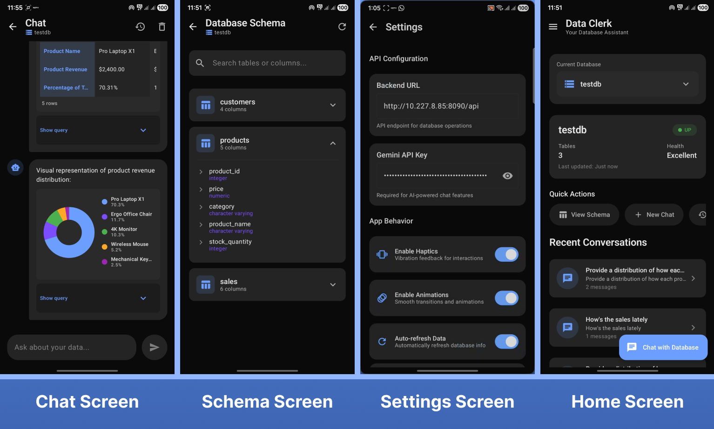

# 📊 Data Clerk - Your Intelligent Database Assistant

<div align="center">


**An Android app that lets you chat with your databases using natural language powered by Google Gemini AI**

[Features](#-features) • [Screenshots](#-screenshots) • [Setup](#-quick-setup) • [Architecture](#-architecture) • [Backend](#-backend)

</div>

---

## 🎯 Overview

Data Clerk is a modern Android application that revolutionizes database interaction by combining natural language processing with traditional database operations. Ask questions in plain English and get instant SQL queries, results in formatted tables, and intelligent visualizations - all with conversation history saved locally.

### Key Highlights

- 🤖 **AI-Powered Queries** - Chat naturally with your database using Google Gemini 2.5-flash
- 📊 **Smart Visualizations** - Automatic chart generation (bar, line, pie) from query results
- 💾 **Conversation History** - All chats stored locally with Room database
- 🎨 **Modern UI** - Built with Jetpack Compose and Material 3 design
- 🔄 **Auto-refresh** - Configurable automatic data refreshing
- 📱 **Haptic Feedback** - Enhanced user experience with tactile responses
- 🌐 **Multi-database** - Switch between multiple PostgreSQL databases seamlessly

---

## ✨ Features

### 🗨️ Natural Language Chat

- Ask questions in plain English (e.g., "Show me top 5 products by revenue")
- AI generates and executes SQL queries automatically
- Results displayed in formatted tables
- Smart chart recommendations based on data

### 📈 Data Visualization

- **Bar Charts** - For categorical comparisons
- **Line Charts** - For trends over time
- **Pie Charts** - For proportional data
- Automatic chart type selection based on query context

### 💬 Conversation Management

- Save all conversations with timestamps
- Resume previous chats from where you left off
- Search and organize conversations by database
- Delete conversations with confirmation
- Auto-generated conversation titles

### 🗄️ Database Operations

- Connect to multiple PostgreSQL databases
- View database schemas with table/column details
- Execute custom SQL queries
- Real-time database health monitoring
- Table and column count statistics

### ⚙️ Settings & Customization

- **Backend URL Configuration** - Point to your API server
- **Gemini API Key** - Configure your AI key
- **Haptic Feedback** - Toggle vibration responses
- **Animations** - Enable/disable UI animations
- **Auto-refresh** - Set refresh intervals (5-300 seconds)
- **Theme Support** - Dark mode optimized

---

## 📸 Screenshots

<div align="center">



</div>

---

## 🚀 Quick Setup

### Prerequisites

- **Android Studio** - Hedgehog (2023.1.1) or later
- **Minimum SDK** - API 27 (Android 8.1)
- **Target SDK** - API 36
- **Kotlin** - 2.0.21
- **JDK** - 17 or higher

### Installation Steps

1. **Clone the repository**

   ```bash
   git clone https://github.com/unnikrishnanNam/DataClerk.git
   cd DataClerk
   ```

2. **Open in Android Studio**

   - File → Open → Select the `DataClerk` folder
   - Wait for Gradle sync to complete

3. **Configure Backend URL**

   - The app comes with a default backend URL: `http://10.227.8.85:8090/api`
   - You can change this in Settings or directly in `PreferencesManager.kt`
   - For Android Emulator, use `http://10.0.2.2:8090/api` for localhost

4. **Get Gemini API Key**

   - Visit [Google AI Studio](https://makersuite.google.com/app/apikey)
   - Create a new API key
   - Open the app → Settings → Enter your Gemini API key

5. **Set up Backend Server**

   - Clone the backend repository (link below)
   - Follow backend setup instructions
   - Ensure PostgreSQL databases are accessible

6. **Build and Run**
   ```bash
   ./gradlew assembleDebug
   # or run directly from Android Studio
   ```

---

## 🏗️ Architecture

### Technology Stack

| Component                | Technology                     |
| ------------------------ | ------------------------------ |
| **Language**             | Kotlin 2.0.21                  |
| **UI Framework**         | Jetpack Compose                |
| **Design System**        | Material 3                     |
| **Architecture**         | MVVM + Repository Pattern      |
| **Networking**           | Retrofit 2.9.0 + OkHttp 4.12.0 |
| **Local Storage**        | Room 2.6.1 + SharedPreferences |
| **Async**                | Kotlin Coroutines 1.8.0 + Flow |
| **Navigation**           | Navigation Compose 2.8.4       |
| **AI Integration**       | Google Gemini 2.5-flash API    |
| **JSON**                 | Gson 2.10.1                    |
| **Dependency Injection** | Manual (lightweight)           |

### Project Structure

```
app/src/main/java/com/unnikrishnan/dataclerk/
├── data/
│   ├── api/                    # Retrofit services
│   │   ├── DataClerkApiService.kt
│   │   ├── GeminiApiService.kt
│   │   └── RetrofitClient.kt
│   ├── local/                  # Room database
│   │   ├── ChatDatabase.kt
│   │   ├── ChatEntities.kt
│   │   ├── ChatDao.kt
│   │   └── Converters.kt
│   ├── models/                 # Data models
│   │   ├── ChatModels.kt
│   │   ├── CommonModels.kt
│   │   └── DatabaseModels.kt
│   ├── preferences/            # SharedPreferences
│   │   └── PreferencesManager.kt
│   └── repository/             # Repository layer
│       ├── ChatHistoryRepository.kt
│       ├── ChatRepository.kt
│       └── DatabaseRepository.kt
├── ui/
│   ├── components/             # Reusable UI components
│   │   ├── PillButton.kt
│   │   ├── ShimmerBox.kt
│   │   └── DatabaseCard.kt
│   ├── screens/                # Screen composables
│   │   ├── chat/
│   │   │   ├── ChatScreen.kt
│   │   │   └── ChatViewModel.kt
│   │   ├── home/
│   │   │   ├── HomeScreen.kt
│   │   │   └── HomeViewModel.kt
│   │   ├── history/
│   │   │   ├── HistoryScreen.kt
│   │   │   └── HistoryViewModel.kt
│   │   ├── schema/
│   │   │   ├── SchemaViewerScreen.kt
│   │   │   └── SchemaViewModel.kt
│   │   ├── settings/
│   │   │   └── SettingsScreen.kt
│   │   ├── splash/
│   │   │   ├── SplashScreen.kt
│   │   │   └── SplashViewModel.kt
│   │   └── error/
│   │       └── ErrorScreen.kt
│   └── theme/                  # Material 3 theming
│       ├── Color.kt
│       ├── Theme.kt
│       └── Type.kt
├── navigation/
│   └── AppNavigation.kt        # Navigation graph
└── MainActivity.kt
```

### Key Design Patterns

- **MVVM (Model-View-ViewModel)** - Separation of UI and business logic
- **Repository Pattern** - Single source of truth for data
- **Flow** - Reactive data streams
- **State Management** - Unidirectional data flow with StateFlow
- **Dependency Injection** - Constructor injection for testability

### Data Flow

```
User Action → ViewModel → Repository → API/Database
                ↓              ↓
            StateFlow ← Transform ← Response
                ↓
           UI Update (Compose)
```

---

## 🔌 Backend

### Backend Repository

The Data Clerk backend is a Node.js/Express API that provides database connectivity and query execution.

**Repository:** [DataClerk Backend](https://github.com/unnikrishnanNam/dataclerk-backend)

### Backend Features

- RESTful API for database operations
- PostgreSQL connection management
- SQL query execution with validation
- Database health monitoring
- Schema introspection
- CORS enabled for development

### Backend API Endpoints

```
GET    /api/databases                          # List all databases
GET    /api/database/{dbname}/health           # Database health check
GET    /api/database/{dbname}/schema           # Get database schema
POST   /api/database/execute                   # Execute SQL query
```

### Backend Quick Setup

```bash
# Clone backend repository
git clone https://github.com/unnikrishnanNam/dataclerk-backend.git
cd dataclerk-backend

# Install dependencies
npm install

# Configure environment
cp .env.example .env
# Edit .env with your PostgreSQL credentials

# Run server
npm start

# Server runs on http://localhost:8090
```

### Backend Environment Variables

```env
PORT=8090
DB_HOST=localhost
DB_PORT=5432
DB_USER=postgres
DB_PASSWORD=your_password
# Add database names as comma-separated list
DATABASES=testdb,postgres,myapp_db
```

---

## 🎨 UI/UX Features

### Design Principles

- **Material 3 Design** - Modern, accessible, and beautiful
- **Dark Theme** - Optimized for low-light environments
- **Consistent Spacing** - 4dp grid system
- **Smooth Animations** - 300ms standard duration with FastOutSlowIn easing
- **Haptic Feedback** - Contextual vibration responses
- **Loading States** - Shimmer effects for better perceived performance

### Color Palette

```kotlin
Background:         #0A0A0F (Deep space black)
Surface:           #12121A (Elevated dark)
Primary Accent:    #6C5DD3 (Purple)
Error:            #E63946 (Red)
Success:          #06D6A0 (Teal)
Info:             #118AB2 (Blue)
```

### Typography

- **Display** - Poppins Bold (32sp)
- **Headline** - Poppins SemiBold (24sp)
- **Title** - Poppins Medium (20sp)
- **Body** - Inter Regular (16sp)
- **Caption** - Inter Regular (12sp)

---

## 📚 Key Dependencies

```toml
[versions]
kotlin = "2.0.21"
compose = "2024.09.00"
retrofit = "2.9.0"
room = "2.6.1"
navigation = "2.8.4"
coroutines = "1.8.0"

[libraries]
# UI
compose-material3
compose-ui
material-icons-extended

# Networking
retrofit
retrofit-gson
okhttp
okhttp-logging

# Database
room-runtime
room-ktx
room-compiler (KSP)

# Async
coroutines-core
coroutines-android

# Other
gson
coil-compose
lottie-compose
```

---

## 🔐 Configuration

### Backend URL Configuration

1. **Via Settings Screen:**

   - Open app → Navigate to Settings
   - Enter your backend URL in "Backend URL" field
   - Changes take effect immediately

2. **Via PreferencesManager:**

   ```kotlin
   // Default URL in PreferencesManager.kt
   private const val DEFAULT_BASE_URL = "http://10.227.8.85:8090/api"
   ```

3. **Via Error Screen:**
   - If connection fails, use "Change Backend URL" button
   - Update URL and retry connection

### Gemini API Configuration

1. Get your API key from [Google AI Studio](https://makersuite.google.com/app/apikey)
2. Open Settings → Enter key in "Gemini API Key" field
3. Key is stored securely in SharedPreferences

---

## 🧪 Testing

### Unit Tests

```bash
./gradlew test
```

### Instrumentation Tests

```bash
./gradlew connectedAndroidTest
```

### Manual Testing Checklist

- [ ] Database list loads correctly
- [ ] Schema viewer displays tables and columns
- [ ] Chat messages send and receive properly
- [ ] Tables render with correct data
- [ ] Charts display based on query results
- [ ] Conversation history saves and loads
- [ ] Settings persist across app restarts
- [ ] Error screen shows on connection failure
- [ ] Auto-refresh works with configured interval
- [ ] Haptic feedback triggers on interactions

---

## 🚧 Known Issues & Limitations

- **Network Requirement** - Requires network connection to backend server
- **Gemini API Limits** - Rate limits apply to free tier (15 requests/minute)
- **Token Limits** - Large query results may exceed token limits (2048 max)
- **Database Support** - Currently optimized for PostgreSQL
- **Chart Types** - Limited to bar, line, and pie charts
- **Offline Mode** - No offline query execution (only history viewing)

---

## 🔮 Roadmap

### Upcoming Features

- [ ] **Multi-language Support** - i18n for global accessibility
- [ ] **Saved Queries** - Bookmark and reuse common queries
- [ ] **Export Data** - Export results to CSV, JSON, or Excel
- [ ] **Dark/Light Theme Toggle** - User-selectable themes
- [ ] **Voice Input** - Speak your queries
- [ ] **Query History** - View past executed queries
- [ ] **Advanced Charts** - Scatter plots, histograms, heatmaps
- [ ] **Database Comparison** - Compare data across databases
- [ ] **Scheduled Queries** - Run queries on a schedule
- [ ] **Collaboration** - Share conversations with team members

### Future Enhancements

- **More Database Support** - MySQL, SQLite, MongoDB
- **Cloud Sync** - Backup conversations to cloud
- **Query Optimization** - AI-powered query suggestions
- **Data Insights** - Automated trend detection
- **Widgets** - Home screen widgets for quick access
- **Wear OS** - Companion app for smartwatches

---

## 🤝 Contributing

Contributions are welcome! Please follow these steps:

1. Fork the repository
2. Create a feature branch (`git checkout -b feature/AmazingFeature`)
3. Commit your changes (`git commit -m 'Add some AmazingFeature'`)
4. Push to the branch (`git push origin feature/AmazingFeature`)
5. Open a Pull Request

### Contribution Guidelines

- Follow Kotlin coding conventions
- Use meaningful commit messages
- Add tests for new features
- Update documentation as needed
- Ensure all tests pass before submitting

---

## 📝 License

This project is licensed under the MIT License - see the [LICENSE](LICENSE) file for details.

---

## 👨‍💻 Developer

**Unnikrishnan**

- GitHub: [@unnikrishnanNam](https://github.com/unnikrishnanNam)
- Email: unnikrishnan@example.com

---

## 🙏 Acknowledgments

- **Google Gemini** - For powering the AI chat functionality
- **Material Design** - For the beautiful design system
- **Jetpack Compose** - For the modern UI toolkit
- **Room Database** - For local data persistence
- **Retrofit** - For seamless API communication
- **PostgreSQL** - For robust database support

---

## 📞 Support

If you encounter any issues or have questions:

1. Check the [Issues](https://github.com/unnikrishnanNam/DataClerk/issues) page
2. Review the [Backend Documentation](https://github.com/unnikrishnanNam/dataclerk-backend)
3. Open a new issue with detailed description
4. Contact via email: unnikrishnan@example.com

---

## 📊 Stats


---

<div align="center">

**Made with ❤️ using Kotlin & Jetpack Compose**

⭐ Star this repo if you find it useful!

</div>
